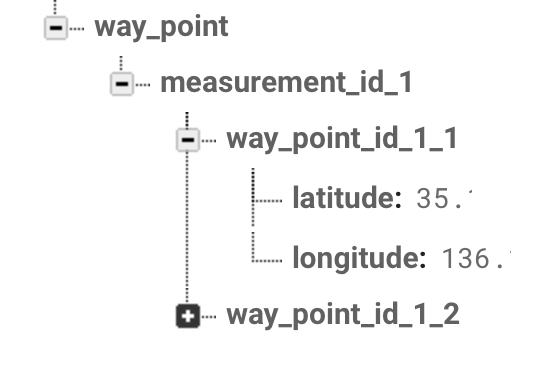

# IF仕様

## 1. Firebase
アプリとサーバの通信は、Firebaseを利用します。  
データ送信にはFirebaseでのログインが必要です。

## 2. 測定データ
移動体で取得した測定データをサーバへ送信します。

### 2.1 送信項目
| Key | Type | Memo |
|:---|:---|:---|
| date | STRING | YYYYMMDD (パーティション) |
| time | INTEGER | 測定時間(UNIXTIME) |
| latitude | FLOAT | 緯度(-90 ~ +90) |
| longitude | FLOAT | 経度(-180 ~ +180) |
| temperature | FLOAT | 温度(℃) |
| humidity | FLOAT | 湿度(%) |
| discomfort_index | FLOAT | 不快指数 |

### 2.2 実装例
```
DatabaseReference dbRef = FirebaseDatabase.getInstance().getReference();
dbRef.child("log").child(date).child(unixTime).updateChildren(data);

// 例
// date: 20080701
// unixTime: 1214850737
// data: 送信項目（date除く）
```
### 2.3 DB構成


## 3. Waypoint
WayPointをサーバで保存します。

### 3.1 送信項目
| Key | Type | Memo |
|:---|:---|:---|
| measurement_id | STRING | 測定ID（WayPointのセットを特定） |
| waypoint_id | STRING | WayPointID |
| latitude | FLOAT | 緯度(-90 ~ +90) |
| longitude | FLOAT | 経度(-180 ~ +180) |


### 3.2 実装例
```
DatabaseReference dbRef = FirebaseDatabase.getInstance().getReference();
dbRef.child("way_point").setValue(data);

// 例
// data: 送信項目
```
### 3.3 DB構成
